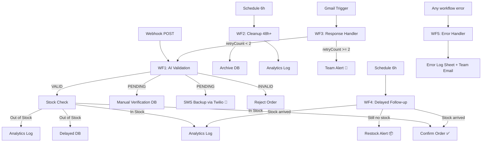
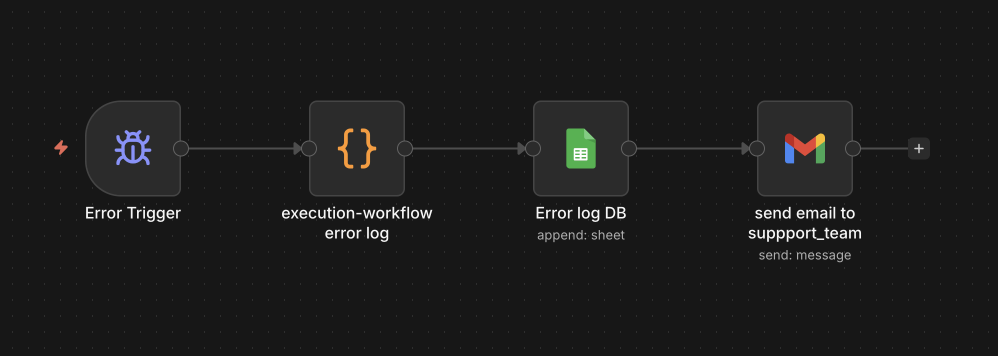

# 🚴 Bicycle Order Management System - n8n Automation

## 📋 Project Overview

## 🔄 Universal Application

**Note:** This system uses bicycle orders as a demonstration, but the logic is **fully adaptable** to any business model:

- 🛍️ **E-commerce:** Any product catalog (clothing, electronics, furniture)
- 📦 **B2B:** Lead qualification and supplier management
- 🏠 **Real Estate:** Property inquiry handling and follow-ups
- 🎓 **Education:** Course enrollment and student onboarding
- 🍕 **Food Delivery:** Order intake and kitchen management
- 💼 **Services:** Appointment booking and client management

Simply replace:

- "Bicycle Models" → Your product/service name
- "Stock" → Your resource availability
- "Warehouse" → Your fulfillment system

The **AI validation**, **loop prevention**, **delayed follow-up**, and **centralized error handling** logic remain universal.

An end-to-end automated order management system for bicycle e-commerce, built entirely with **n8n workflows**. The system handles order intake, AI-powered data validation, inventory management, customer follow-ups, automated restocking alerts, and full observability via analytics logging and error monitoring.

**Key Features:**

- 🤖 AI-powered customer data validation (OpenAI GPT-4)
- 📦 Real-time inventory tracking and stock management
- 🔄 Automated customer response processing with loop prevention
- ⏰ Time-based order cleanup (>48h auto-discard)
- 📧 Smart email notifications to customers and warehouse team
- 📱 SMS backup via Twilio for unreachable customers
- 🔓 Automatic order unlock when stock becomes available
- 🚨 Centralized error handling and logging (WF5)
- 📊 Analytics log tracking all order lifecycle events

---

## 🏗️ System Architecture

The system consists of **5 workflows**:

```
WF1: Order Intake & Validation
↓
WF2: Stale Order Cleanup (runs every 6h)
↓
WF3: Customer Response Handler
↓
WF4: Delayed Orders Follow-up (runs every 6h)
↓
WF5: Centralized Error Handler (triggered on any workflow failure)
```

### Visual Architecture



---

## 🏛️ Architecture Decisions

> This section explains **why** specific choices were made, not just **what** the system does.

### Why 5 separate workflows instead of 1 monolithic flow?

Each workflow has a single responsibility and can fail independently without affecting the others. WF2 and WF4 run on a schedule — merging them with WF1 would create unnecessary coupling, harder debugging, and unpredictable execution timing. Separation also allows activating/deactivating each workflow independently during maintenance.

### Why Google Sheets as the database layer?

Chosen for portfolio visibility and zero-infrastructure setup — anyone can clone, configure credentials, and run the system without provisioning a server. In a production scenario, this layer would be replaced with **Postgres or Supabase** to support atomic transactions and proper concurrency handling.

### Why cap retryCount at 2?

Prevents infinite loops while giving customers two correction attempts. After 2 failed re-validations, human review is statistically more efficient than further automation. The threshold is intentionally low to avoid customer frustration from repeated emails.

### Why use OpenAI for validation instead of pure regex?

Regex handles structured patterns but fails on ambiguous real-world data — e.g., a partial address that looks plausible but is incomplete. GPT-4 can reason about context, classify edge cases into PENDING rather than VALID/INVALID, and extract structured data from unstructured email replies in WF3. The tradeoff is latency and API cost, which is acceptable at this order volume.

### Why SMS backup for PENDING_VERIFICATION orders?

If a customer provides an invalid email, no email-based recovery is possible. Twilio SMS provides a second contact channel specifically for the `PENDING_VERIFICATION` branch — the only scenario where the customer's contact data is suspect. If both email and phone are invalid, WF2 automatically discards the order after 48h.

### Why a centralized error handler (WF5)?

Duplicating error logic across 4 workflows creates maintenance overhead. A single WF5 configured via n8n's native "Error Workflow" setting receives all failures, logs them consistently to a dedicated sheet, and notifies the team. One place to update, one sheet to monitor.

---

## ⚠️ Known Limitations & Design Decisions

### Inventory Race Condition

**Current behavior:** WF1 reads stock, compares, then updates in three sequential steps. If two orders arrive simultaneously via webhook, both reads could return the same stock value before either write completes, potentially confirming orders that exceed available inventory.

**Why it's acceptable here:** Google Sheets does not support row-level locking or atomic transactions. This is a known constraint of using Sheets as a database layer.

**Production solution:** Replace Google Sheets with a database that supports atomic operations (Postgres `SELECT FOR UPDATE`, Supabase RPC functions). The workflow logic remains identical — only the database layer changes.

### Schedule-Based Polling (WF2, WF4)

Running every 6 hours means delayed order processing has up to a 6-hour lag. This is a deliberate tradeoff between resource usage and responsiveness. In a higher-volume system, a webhook-based stock update trigger would replace the schedule.

### Gmail Polling Latency (WF3)

Gmail trigger polls every minute. For time-sensitive responses, a push notification approach (Gmail Pub/Sub) would reduce latency to near-real-time.

### SMS Twilio — Trial Account

SMS backup is fully integrated in WF1's PENDING_VERIFICATION branch. Live delivery requires a funded Twilio account. The workflow node is active and correctly configured — the integration point is production-ready.

---

## ⚙️ Setup & Configuration

### Prerequisites

- n8n instance (self-hosted or n8n Cloud)
- OpenAI API key (GPT-4 access)
- Google account with Google Sheets and Gmail access
- Gmail account configured as both sender and trigger
- Twilio account with a Messaging Service SID (for SMS backup)

### Configuration Steps

1. **Import workflows** — import all 5 JSON files into n8n (`WF1`, `WF2`, `WF3`, `WF4`, `WF5`)
2. **Configure credentials** in n8n:
   - `OpenAI API` — API key with GPT-4 access
   - `Google Sheets OAuth2` — service account or OAuth
   - `Gmail OAuth2` — for both trigger and send nodes
   - `Twilio` — Account SID + Auth Token
3. **Create Google Sheets** with the schema described in the "Database Structure" section below (7 sheets total)
4. **Update Sheet IDs** — paste your Google Sheet IDs into each Google Sheets node
5. **Link WF1 webhook URL** — copy WF1's webhook URL and paste it into WF3's HTTP Request node
6. **Set WF5 as Error Workflow** — in each workflow's Settings, set "Error Workflow" to WF5
7. **Activate** WF2 and WF4 schedule triggers
8. **Test** using the sample payload below

### Sample Test Payload (WF1 Webhook)

Send a `POST` request to your WF1 webhook URL with this body:

```json
{
  "id": "ORD-1770399228846-695",
  "customerName": "Mario Rossi",
  "email": "mario.rossi@example.com",
  "phone": "+39 02 1234567",
  "shippingAddress": "Via Roma 12, 20121 Milano, Italy",
  "bicycleModel": "Mountain Pro 29",
  "quantity": "2",
  "price": "900",
  "notes": "Please deliver in the afternoon",
  "timestamp": "2025-02-19T11:00:00.000Z"
}
```

**Expected results by scenario:**

| Scenario | AI Result | System Action |
|---|---|---|
| All fields valid | `VALID` | Stock check → CONFIRMED or DELAYED |
| Missing ZIP/city | `PENDING_VERIFICATION` | Manual DB + Email + SMS backup |
| Fake/test data | `INVALID` | Order rejected immediately |

---

## 📊 Database Structure

### Google Sheets — 7 sheets total:

1. **Inventory - Warehouse**
   - `bicycleModel` \| `stock` \| `price` \| `orderStatus` \| `lastUpdated`

2. **Orders - Monthly**
   - `id` \| `customerName` \| `email` \| `phone` \| `shippingAddress` \| `bicycleModel` \| `quantity` \| `price` \| `notes` \| `orderStatus` \| `timestamp`

3. **Manual Verification DB**
   - `id` \| `customerName` \| `email` \| `phone` \| `shippingAddress` \| `bicycleModel` \| `quantity` \| `price` \| `orderStatus` \| `notes` \| `timestamp` \| `validatedAt` \| `retryCount`

4. **Orders DELAYED**
   - `id` \| `customerName` \| `email` \| `phone` \| `shippingAddress` \| `bicycleModel` \| `quantity` \| `price` \| `notes` \| `orderStatus` \| `timestamp`

5. **Archive / NO_SHOW_UP**
   - `id` \| `customerName` \| `phone` \| `email` \| `shippingAddress` \| `orderStatus` \| `timestamp` \| `discardedAt`

6. **Analytics Log**
   - `timestamp` \| `orderId` \| `customerName` \| `bicycleModel` \| `quantity` \| `price` \| `event` \| `workflowSource`

7. **Error Log** *(WF5)*
   - `timestamp` \| `workflowName` \| `errorMessage` \| `executionId`

---

## 🔄 Workflow Details

### **WF1 - ORDER INTAKE & VALIDATION**

**Purpose:** Receives new orders, validates customer data via AI, checks inventory, and routes orders accordingly.

**Flow:**

```
📥 Webhook (POST)
↓
🤖 AI Validation (OpenAI GPT-4)
├─ VALID → Continue to stock check
├─ PENDING_VERIFICATION → Manual DB + Email + SMS (Twilio)
└─ INVALID → Reject order
↓
📊 Read Inventory
↓
💻 Code: Compare stock vs quantity
↓
🔀 IF: Stock available?
├─ ✅ YES:
│   ├─ Update Inventory (decrease stock)
│   ├─ Save to Orders DB (CONFIRMED)
│   ├─ Email: Order Confirmed
│   └─ Analytics Log: ORDER_CONFIRMED
└─ ❌ NO:
    ├─ Save to DELAYED orders
    ├─ Email: Delay notification
    └─ Analytics Log: ORDER_DELAYED
```

**AI Validation Logic:**

- **VALID:** Email contains @, phone 9-15 digits, complete address with street + city + ZIP
- **PENDING_VERIFICATION:** Data looks real but incomplete (missing city/ZIP or suspicious domain)
- **INVALID:** Fake data, test words, phone <9 digits


---

### **WF2 - STALE ORDER CLEANUP**

**Purpose:** Automatically discards orders stuck in PENDING_VERIFICATION for >48 hours.

**Flow:**

```
⏰ Schedule Trigger (every 6h)
↓
📊 Read: Orders with status = PENDING_VERIFICATION
↓
💻 Code: Calculate elapsed time
↓
🔀 IF: >48 hours?
└─ ✅ YES:
    ├─ Copy to Archive DB
    ├─ Email: Notify team
    └─ Analytics Log: ORDER_DISCARDED
```

**Logic:**

```javascript
const now = new Date();
const threshold48h = 48 * 60 * 60 * 1000;
const elapsed = now - new Date(order.timestamp);
const shouldDiscard = elapsed > threshold48h;
```


---

### **WF3 - CUSTOMER RESPONSE HANDLER**

**Purpose:** Processes customer email replies with corrected data, prevents infinite loops with retry counter.

**Flow:**

```
📧 Gmail Trigger (polls every 1 min)
    ↓
🤖 AI Extraction (OpenAI GPT-4)
    Extract: orderId, corrected email, phone, address
    ↓
💻 Code: Parse JSON response
    ↓
📊 Read: Fetch order from Manual Verification DB
    ↓
💻 Code: Merge data + increment retryCount
    ↓
🔀 IF: retryCount < 2?
    ├─ ✅ YES:
    │   ├─ Update Manual DB
    │   └─ HTTP Request → Loop back to WF1 webhook
    └─ ❌ NO (≥2):
        └─ Email: Alert team (manual intervention needed)
```

**Loop Prevention:**

- Each order starts with `retryCount = 0`
- After 2 failed re-validation attempts, stops auto-retry
- Team receives alert for manual review


---

### **WF4 - DELAYED ORDERS FOLLOW-UP**

**Purpose:** Monitors delayed orders, automatically unlocks them when stock arrives, sends restock alerts to warehouse.

**Flow:**

```
⏰ Schedule Trigger (every 6h)
    ↓
📊 Read: DELAYED orders
    ↓
📊 Read: Current inventory
    ↓
💻 Code: Compare & calculate restock needs
    ↓
🔀 Switch (by type):
    ├─ 📦 RESTOCK:
    │   └─ Email: Warehouse reorder alert
    └─ 🔓 UNLOCK:
        ├─ Update: Inventory (decrease stock)
        ├─ Update: DELAYED order → CONFIRMED
        ├─ Update: Move to main Orders DB
        ├─ Email: Confirmation to customer
        └─ Analytics Log: ORDER_UNLOCKED
```

**Restock Logic:**

```javascript
const REORDER_POINT = 5;
const TARGET_STOCK = 15;

// Scenario A: Delayed orders need stock
if (stock < orderedQty) {
  suggestedOrder = orderedQty - stock;
}

// Scenario B: Stock below threshold
if (stock <= REORDER_POINT) {
  suggestedOrder = TARGET_STOCK - stock;
}
```


---

### **WF5 - CENTRALIZED ERROR HANDLER**

**Purpose:** Catches failures from any workflow automatically via n8n's native Error Workflow setting, logs them to a dedicated sheet, and notifies the team.

**Flow:**

```
🚨 Error Trigger (auto-fired by n8n on any WF crash)
    ↓
💻 Code: Format error payload
    Extract: workflowName, errorMessage, executionId, timestamp
    ↓
📊 Append to Error Log sheet
    ↓
📧 Email: Alert team with full error context
```

**Why this matters:** All 4 workflows route failures to WF5 via Settings → Error Workflow. One place to update notification logic, one sheet to monitor system health.



---

## 🛠️ Technologies Used

- **n8n** - Workflow automation platform
- **OpenAI GPT-4** - AI-powered data validation and extraction
- **Google Sheets** - Database layer (7 sheets)
- **Gmail API** - Email triggers and notifications
- **Twilio** - SMS backup notifications
- **JavaScript** - Custom logic in Code nodes
- **Webhooks** - External integration endpoints

---

## 🚀 Key Features Implemented

### 1. **AI-Powered Validation**

- Real-time customer data quality check
- Smart routing based on data completeness
- Natural language email parsing in WF3

### 2. **Loop Prevention Mechanism**

- Retry counter prevents infinite webhook loops
- Automatic escalation to human intervention after 2 attempts
- Graceful failure handling

### 3. **Inventory Synchronization**

- Real-time stock updates across workflows
- Accurate stock tracking for concurrent orders
- Automatic delayed order unlocking when stock arrives

### 4. **Time-Based Automation**

- 6-hour schedule for cleanup and follow-ups
- 48-hour threshold for order abandonment
- Timestamp tracking for all operations

### 5. **Multi-Channel Notifications**

- Customer order confirmations via email
- SMS backup via Twilio for PENDING_VERIFICATION orders
- Warehouse restock alerts with suggested quantities
- Team escalation emails on retry exhaustion

### 6. **Full Observability**

- Analytics Log tracking every lifecycle event (CONFIRMED, DELAYED, DISCARDED, UNLOCKED)
- Centralized Error Log via WF5 for all workflow failures
- Team email notifications with execution ID for debugging

---

## 📈 System Flow Examples

**Scenario: Customer orders 2 mountain bikes — stock available**

1. WF1 receives order via webhook
2. AI validates data → VALID ✅
3. Check inventory → 10 bikes available
4. Update stock → 8 bikes remaining
5. Save order → CONFIRMED
6. Email sent → "Order confirmed, delivery in 2-4 days"
7. Analytics Log → `ORDER_CONFIRMED`

**Scenario: Stock insufficient**

1. Order saved to DELAYED database
2. Customer receives delay notification email
3. Analytics Log → `ORDER_DELAYED`
4. WF4 monitors every 6 hours
5. When stock arrives → auto-unlock
6. Customer receives confirmation email
7. Analytics Log → `ORDER_UNLOCKED`

**Scenario: Customer data incomplete**

1. Order saved to Manual Verification DB
2. Customer receives email requesting correction
3. SMS backup sent via Twilio (fallback if email is invalid)
4. WF3 monitors Gmail for reply
5. AI extracts corrected data → re-routes to WF1
6. After 2 failed retries → team alert for manual review

**Scenario: Workflow crash**

1. Any node in WF1–WF4 throws an error
2. n8n automatically triggers WF5
3. Error logged to Error Log sheet
4. Team receives email with workflow name, error message, execution ID

---

## 🔒 Error Handling

- **Empty database handling:** Workflows return `[]` gracefully
- **Type conversion:** Automatic string-to-number conversion in comparisons
- **Missing fields:** Default values with `|| 0` and `|| ''`
- **AI parsing errors:** JSON cleaning before parse, orderId typo fix applied
- **Retry exhaustion:** Manual intervention fallback after 2 attempts
- **Workflow failures:** Centralized WF5 error handler with sheet logging and email alert

---

## 📝 Future Improvements

- Replace Google Sheets with Postgres/Supabase for atomic inventory transactions
- Add Pub/Sub Gmail trigger to reduce WF3 polling latency
- Implement multi-warehouse support
- Add dynamic pricing based on stock levels
- Create customer-facing order tracking dashboard
- Weekly automated report (revenue, order status breakdown, low stock alerts)

---

## 👤 Author

**Fabio Roggero**

- 🌍 Languages: Italian, Spanish, English, German
- 🎯 Focus: Workflow automation, n8n, AI integration
- 📧 Contact: [fabio.roggero90@gmail.com](mailto:fabio.roggero90@gmail.com)
- 🔗 LinkedIn: [www.linkedin.com/in/f-roggero](http://www.linkedin.com/in/f-roggero)

---

## 📄 License

This project is for portfolio demonstration purposes.

---

**Built with ❤️ using n8n automation**


